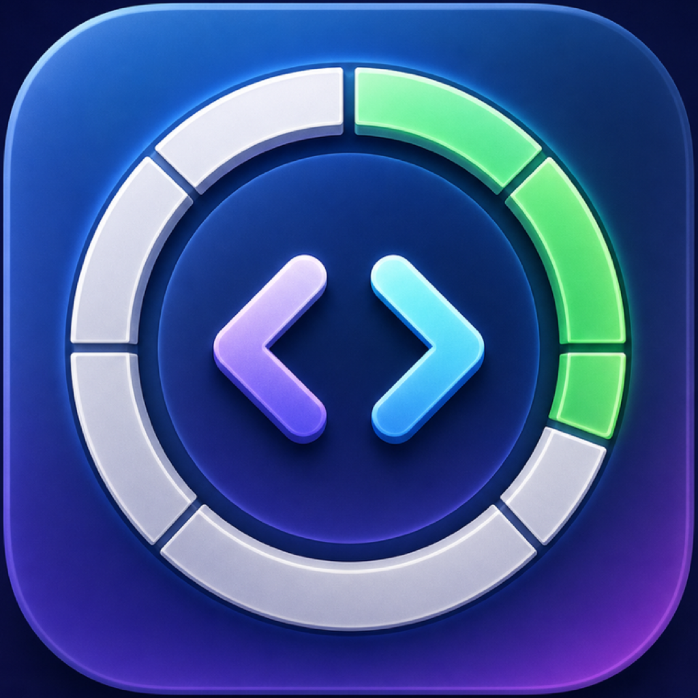

# Codex Weekly

<p align="center">
  <a href="README.md">English</a> | <strong>简体中文</strong>
</p>

<p align="center">
  
</p>

<p align="center">
  <a href="https://github.com/Pototoooo/codex-weekly/actions/workflows/ci.yml"></a>
  <a href="https://github.com/Pototoooo/codex-weekly/releases/latest"></a>
  <a href="LICENSE"></a>
</p>

一个轻量的原生 macOS 菜单栏工具，显示当前 Codex 账号的**一周剩余额度**和重置时间。

> 这是独立的社区项目，与 OpenAI 无隶属、背书或赞助关系。

## 特点

- 菜单栏直接显示剩余百分比
- 每 60 秒自动刷新，也可手动刷新
- 自动适配浅色、深色及全屏菜单栏背景
- 低额度时切换为警告图标，不依赖固定颜色
- 显示已使用比例及下一次重置时间
- 可选“登录时启动”
- 原生多分辨率 macOS 应用图标
- 不读取、复制或上传 `~/.codex/auth.json`；额度通过本机 Codex CLI 的 `app-server` 接口读取

## 安装

1. 从[最新版本](https://github.com/Pototoooo/codex-weekly/releases/latest)下载 `Codex-Weekly-macOS.zip`。
2. 解压安装包。
3. 将 `Codex Weekly.app` 拖入 `/Applications`。
4. 双击运行。它是菜单栏软件，不会出现在程序坞中。
5. 如果 macOS 阻止未经公证的社区构建，请在 Finder 中右键应用并选择“打开”。

需要本机已安装并登录 Codex 桌面版或 Codex CLI。

## 构建与验证

```bash
./build-app.sh
.build/release/CodexWeekly --probe
```

构建结果位于 `dist/`。要求 macOS 13+ 与 Xcode/Swift 6。

## 工作原理

应用启动本机 Codex CLI 的 `app-server --stdio`，调用
`account/rateLimits/read` 获取额度窗口，并显示时长为 10,080 分钟（一周）的额度窗口。

- 不直接读取 `~/.codex/auth.json`
- 不复制或上传 Codex Token
- 不包含统计、遥测或第三方网络请求
- 所有额度读取均由本机 Codex CLI 完成

Codex CLI app-server 属于实验性接口，未来协议变化可能需要同步适配。

## 开发

```bash
swift test
swift run CodexWeekly --probe
```

主要结构：

- `CodexQuotaClient.swift`：Codex app-server 通信
- `QuotaSnapshot.swift`：周额度解析和窗口选择
- `AppDelegate.swift`：菜单栏 UI、刷新及开机启动
- `QuotaParserTests.swift`：协议响应解析测试

## License

[MIT](LICENSE)
